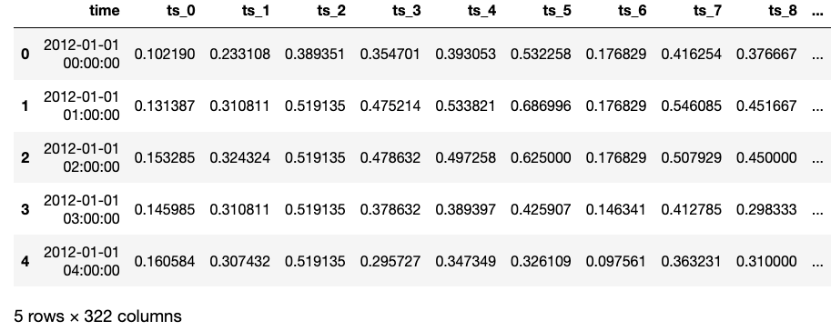
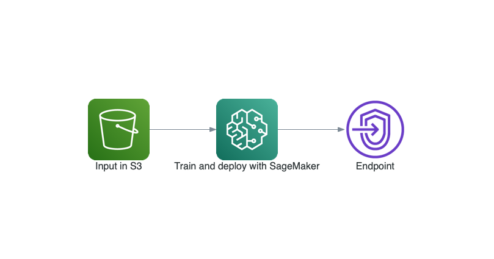
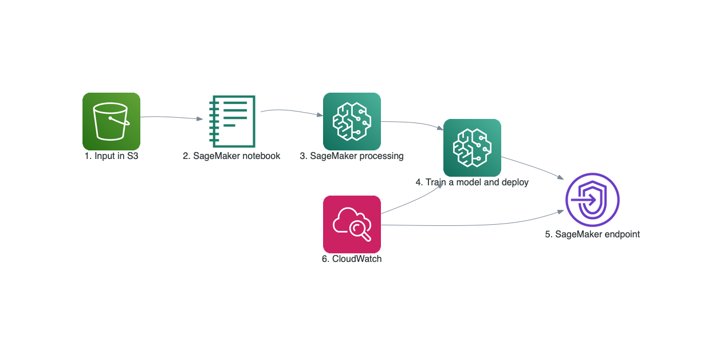
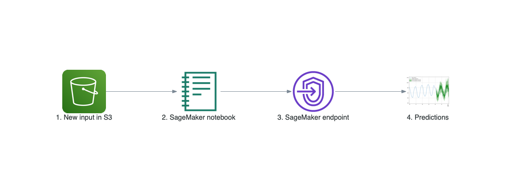

# Deep Demand Forecasting with Amazon SageMaker

  
  
  
  
   
  
  
  
 

This project provides an end-to-end solution for **Demand Forecasting** task using a new state-of-the-art *Deep Learning* model [LSTNet](https://arxiv.org/abs/1703.07015) available in [GluonTS](https://github.com/awslabs/gluon-ts) and [Amazon SageMaker](https://aws.amazon.com/sagemaker/).

## Overview

### How Does the Input Data Look Like?

The input data is a **multi-variate time-series**.

An example includes hourly [electricity consumption]((https://archive.ics.uci.edu/ml/datasets/ElectricityLoadDiagrams20112014)) of 321 users over the period of 41 months. Here is a snapshot of the normalized data

  

### How to Prepare Your Data to Feed into the Model?

We have provided example of how to feed your time-series data with GluonTS in the notebook. To convert CSV data or other formats to GluonTS format, please see the [customization](#customization).

### What Are the Outputs?

1. A trained LSTNet model and
2. A SageMaker endpoint that can predict the future (multi-variate) values given a prediction interval

For example, we can estimate the hourly electricity consumption of 321 users for the coming week.
### What Algorithm is Used?

We have implemented [LSTNet](https://arxiv.org/abs/1703.07015) which is a state-of-the-art Deep Learning model and is available in [GluonTS](https://github.com/awslabs/gluon-ts).

### What is the Estimated Cost?

Running the solution end-to-end costs less than $5 USD. Please make sure you have read the cleaning up part [here](#cleaning-up).

### How does the Data Flow look like?

  

## Solution Details

Demand forecasting uses historical time-series data to help streamline the supply-demand decision-making process across businesses. Examples include predicting the number of

* Customer representatives to hire for multiple locations in the next month
* Product sales across multiple regions in the next quarter
* Cloud server usage for next day for a video streaming service
* Electricity consumption for multiple regions over the next week
* IoT devices and sensors such as energy consumption

## Deep Learning for Time Series Forecasting

The status quo approaches for time-series forecasting include:

* [Auto Regressive Integrated Moving Average](https://en.wikipedia.org/wiki/Autoregressive_integrated_moving_average) (ARIMA) for **univariate** time-series data and
* [Vector Auto-Regression](https://en.wikipedia.org/wiki/Vector_autoregression) (VAR) for **multi-variate** time-series data

These methods often require tedious data preprocessing and features generation prior to model training. One main advantage of Deep Learning (DL) methods such as LSTNet is *automating the feature generation* step prior to model training such as incorporating various data normalization, lags, different time scales, some categorical data, dealing with missing values, etc. with better prediction power and fast GPU-enabled training and deployment.

Please check out our [blog post](https://towardsdatascience.com/deep-demand-forecasting-with-amazon-sagemaker-e0226410763a) for more details.

## Getting Started

You will need an AWS account to use this solution. Sign up for an account [here](https://aws.amazon.com/).

To run this JumpStart 1P Solution and have the infrastructure deploy to your AWS account you will need to create an active SageMaker Studio instance (see Onboard to Amazon SageMaker Studio). When your Studio instance is Ready, use the instructions in SageMaker JumpStart to 1-Click Launch the solution.

The solution artifacts are included in this GitHub repository for reference.

*Note*: Solutions are available in most regions including us-west-2, and us-east-1.

**Caution**: Cloning this GitHub repository and running the code manually could lead to unexpected issues! Use the AWS CloudFormation template. You'll get an Amazon SageMaker Notebook instance that's been correctly setup and configured to access the other resources in the solution.

  

## Contents

* `cloudformation/`
  * `deep-demand-forecast.yaml`: The root cloudformation nested stack which creates the AWS stack for this solution
  * `deep-demand-forecast-sagemaker-notebook-instance.yaml`: Creates SageMaker notebook instance
  * `deep-demand-forecast-permissions.yaml`: Manages all the permission necessary to launch the stack
  * `deep-demand-forecast-endpoint.yaml`: Creates demo endpoint using in `demo.ipynb`
  * `solution-assistant`: Deletes the created resources such as endpoint, S3 bucket etc. during cleanup
* `src/`
  * `preprocess/`
    * `container/`: To build and register the preprocessing ECR job
      * `Dockerfile`: Docker container config
      * `build_and_push.sh`: Build and push bash scripts used in `deep-demand-forecast.ipynb`
      * `requirements.txt`: Dependencies for `preprocess.py`
    * `container_build/`: Uses `CodeBuild` to the build the container for ECR
    * `preprocess.py`: Preprocessing script
  * `deep_demand_forecast/`: Contains the train and inference code
    * `train.py`: SageMaker train code
    * `inference.py`: SageMaker inference code
    * `data.py`: [`GluonTS`](https://gluon-ts.mxnet.io/api/gluonts/gluonts.dataset.html) data preparation
    * `metrics.py`: A training metric
    * `monitor.py`: Preparing results for visualization
    * `utils.py`: Helper functions
    * `requirements.txt`: Dependencies for SageMaker MXNet Estimator
  * `demo.ipynb`: Demo notebook to quickly get some predictions from the demo endpoint
  * `deep-demand-forecast.ipynb`: See below

## What Does `deep-demand-forecast.ipynb` Offer?

The notebook trains an [LSTNet](https://gluon-ts.s3-accelerate.dualstack.amazonaws.com/master/api/gluonts/gluonts.model.lstnet.html) estimator [*on electricity consumption data*](https://archive.ics.uci.edu/ml/datasets/ElectricityLoadDiagrams20112014) which is multivariate time-series dataset capturing the electricity consumption (in kW) with **15min** frequency from **2011-01-01** to **2014-05-26**. We compare the model performance by visualizing the metrics [MASE](https://en.wikipedia.org/wiki/Mean_absolute_scaled_error) vs. [sMAPE](https://en.wikipedia.org/wiki/Symmetric_mean_absolute_percentage_error).

Finally, we deploy an endpoint for the trained model and can interactively compare its performance by comparing the train, test data and predictions.

  

For example, here, re-training with more epochs would be helpful to increase the model performance and we can re-deploy.

## Architecture Overview

Here is architecture for the end-to-end training and deployment process

  

1. The input data located in an [Amazon S3](https://aws.amazon.com/s3/) bucket
2. The provided [SageMaker notebook](source/deep_demand_forecast.ipynb) that gets the input data and launches the later stages below
3. [**Preprocessing**](src/preprocess) step to normalize the input data. We use [SageMaker processing](https://sagemaker.readthedocs.io/en/stable/amazon_sagemaker_processing.html) job that is designed as a *microservice*. This allows users to build and register their own Docker image via [Amazon ECR](https://aws.amazon.com/ecr/) and execute the job using [Amazon SageMaker](https://aws.amazon.com/sagemaker/)
4. **Training an LSTNet model** using the previous preprocessed step and evaluating its results using Amazon SageMaker. If desired, one can deploy the trained model and create a SageMaker endpoint
5. **SageMaker endpoint** created from the previous step, is an [HTTPS endpoint](https://docs.aws.amazon.com/sagemaker/latest/dg/how-it-works-hosting.html) and is capable of producing predictions
6.  Monitoring the training and deployed model via [Amazon CloudWatch](https://aws.amazon.com/cloudwatch/)

Here is the architecture of the inference

  

1. The input data, located in an [Amazon S3](https://aws.amazon.com/s3/) bucket
2. From SageMaker notebook, normalize the new input data using the statistics of the training data
3. Sending the requests to the SageMaker endpoint
4. Predictions
## Cleaning Up

When you've finished with this solution, make sure that you delete all unwanted AWS resources. AWS CloudFormation can be used to automatically delete all standard resources that have been created by the solution and notebook. Go to the AWS CloudFormation Console, and delete the parent stack. Choosing to delete the parent stack will automatically delete the nested stacks.

**Caution:** You need to manually delete any extra resources that you may have created in this notebook. Some examples include, extra Amazon S3 buckets (to the solution's default bucket), extra Amazon SageMaker endpoints (using a custom name), and extra Amazon ECR repositories.

## Customization

To use your own data, please take a look at

* [Extensive GluonTS tutorials](https://gluon-ts.mxnet.io/examples/index.html)
* Consult with the [dataset API](https://gluon-ts.mxnet.io/api/gluonts/gluonts.dataset.html)

## Useful Resources

* [Amazon SageMaker Getting Started](https://aws.amazon.com/sagemaker/getting-started/)
* [Amazon SageMaker Developer Guide](https://docs.aws.amazon.com/sagemaker/latest/dg/whatis.html)
* [Amazon SageMaker Python SDK Documentation](https://sagemaker.readthedocs.io/en/stable/)
* [AWS CloudFormation User Guide](https://docs.aws.amazon.com/AWSCloudFormation/latest/UserGuide/Welcome.html)

## License

This project is licensed under the Apache-2.0 License.
