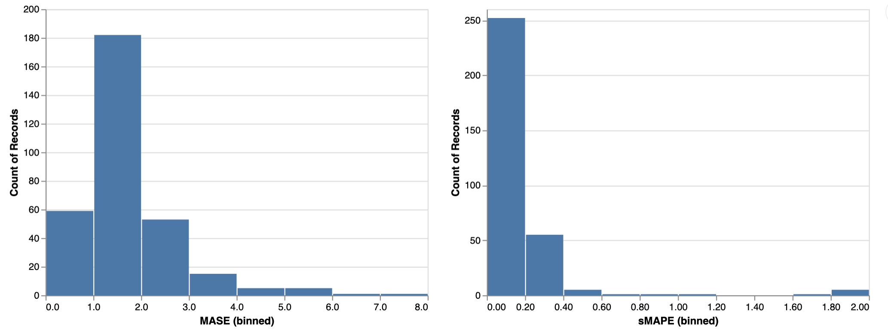

# Deep Demand Forecasting with Amazon SageMaker

This project provides an end-to-end solution for **Demand Forecasting** task using *Deep Learning* model [LSTNet](https://arxiv.org/abs/1703.07015) available in [gluonts](https://github.com/awslabs/gluon-ts) and [Amazon SageMaker](https://aws.amazon.com/sagemaker/).

## Demand Forecasting

Demand forecasting deals with time-series data targeting various resource demands to streamline the decision-making process across businesses. Examples include predicting the number of

* Product sales across multiple regions in the next quarter
* Electricity consumption for multiple regions in next week
* AWS cloud servers usage for next day for a video streaming service
* Customer representatives to hire for multiple locations in next month

## Classical methods vs. Deep Learning methods

The status quo approaches for time-series forecasting are auto-regressive methods such as [*Auto Regressive Integrated Moving Average*](https://en.wikipedia.org/wiki/Autoregressive_integrated_moving_average) (ARIMA), [*Box-Jenkins*](https://en.wikipedia.org/wiki/Box%E2%80%93Jenkins_method) and *State-Space models* for **uni-variate time-series** data and [*Vector Autoregression*](https://en.wikipedia.org/wiki/Vector_autoregression) (VAR) or *Gaussian Processing* (GP) non-parametric models for **multi-variant** time-series data. The use of Deep Learning (DL) models for (stationary/non-stationary) multi-variate time-series has been a point of research recently. DL methods shine when dealing with *large* number of (correlated) multivariate time-series data that have *categorical features* and (a lot of) *missing values*. 

It is known that for classical methods, tedious data preprocessing and features generation need to be performed prior to model training and one main advantage of DL methods such as LSTNet is automating the feature generation step with better prediction power and fast GPU-enabled training and deployment.

## How to deploy

Navigate to [AWS CloudFormation](https://aws.amazon.com/cloudformation/) in your account and use the provided [CloudFormation template](deploy/sagemaker-deep-demand-forecast.yaml) to create the AWS resources needed to train and deploy the model in SageMaker [deep-demand-forecast](src/deep-demand-forecast.ipynb) notebook.

As an example, notebook trains an LSTNet model on electricity data (only for 1 epoch) and we can compare its performance by visualizing [MASE](https://en.wikipedia.org/wiki/Mean_absolute_scaled_error) vs. [sMAPE](https://en.wikipedia.org/wiki/Symmetric_mean_absolute_percentage_error)

  
  

## Architecture

The project contains

* [**Preprocessing**](src/preprocess) step, designed as a *microservice* that allows users to build and register their own Docker image for this task via [Amazon ECR](https://aws.amazon.com/ecr/) and execute the job in [Amazon SageMaker](https://aws.amazon.com/sagemaker/)
* Interactive **training**, **evaluating** and **visualizing** the results in the provided [SageMaker notebook](source/deep_demand_forecast.ipynb)
* **Deplying** and **testing** an [HTTPS endpoint](https://docs.aws.amazon.com/sagemaker/latest/dg/how-it-works-hosting.html)
* Monitoring the deployed model via [Amazon CloudWatch](https://aws.amazon.com/cloudwatch/)

Here is the visual architecture

  

## License

This project is licensed under the Apache-2.0 License.
