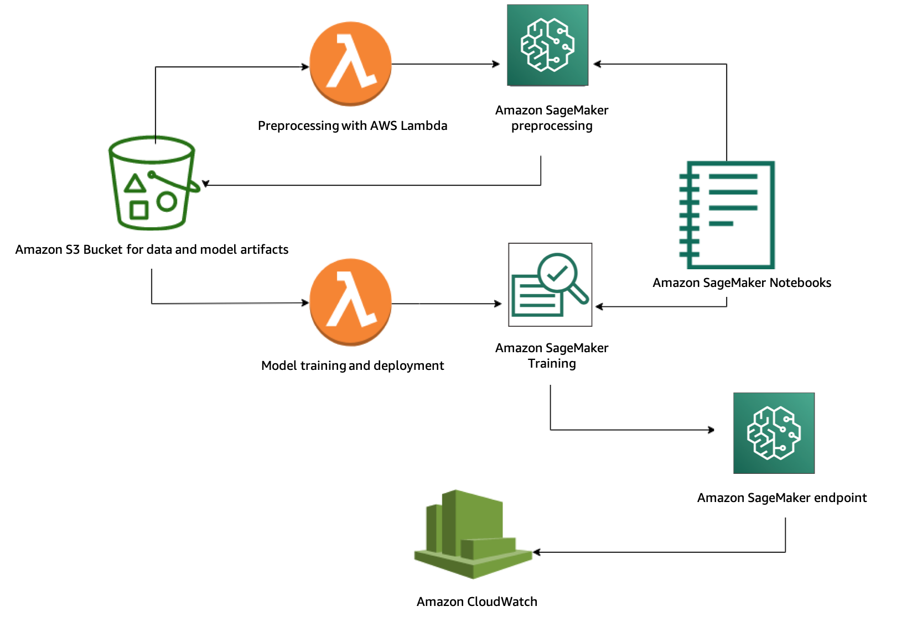

# Deep Demand Forecasting with Amazon SageMaker

This project provides an end-to-end solution for **Demand Forecasting** task using *Deep Learning* model [LSTNet](https://arxiv.org/abs/1703.07015) available in [gluonts](https://github.com/awslabs/gluon-ts) with [Amazon SageMaker](https://aws.amazon.com/sagemaker/).

## Demand Forecasting

Demand forecasting deals with time-series data targeting various resource demands to streamline the decision-making process across businesses. Examples include predicting the number of

* Product sales across multiple regions in the next quarter
* Electricity consumption for multiple regions in next week
* AWS cloud servers usage for next day for a video streaming service
* Customer representatives to hire for multiple locations in next month

## Deployment

Please go to [AWS CloudFormation](https://aws.amazon.com/cloudformation/) in your account and use the provided [CloudFormation template](deploy/sagemaker-deep-demand-forecast.yaml) to create the AWS resources needed to train and deploy the model in SageMaker [deep_demand_forecast](src/deep_demand_forecast.ipynb) notebook.

As an example, notebook trains an LSTNet model on electricity data (only for 1 epoch) and we can compare its performance by visualizing [MASE](https://en.wikipedia.org/wiki/Mean_absolute_scaled_error) vs. [sMAPE](https://en.wikipedia.org/wiki/Symmetric_mean_absolute_percentage_error)

  

## Architecture

The project contains

* [**Preprocessing**](src/preprocess) step, designed as a *microservice* that allows users to build and register their own Docker image for this task via [Amazon ECR](https://aws.amazon.com/ecr/) and execute the job in [Amazon SageMaker](https://aws.amazon.com/sagemaker/)
* Interactive **training**, **evaluating** and **visualizing** the results in the provided [SageMaker notebook](source/deep_demand_forecast.ipynb)
* **Deplying** and **testing** an [HTTPS endpoint](https://docs.aws.amazon.com/sagemaker/latest/dg/how-it-works-hosting.html)
* Monitoring the deployed model via [Amazon CloudWatch](https://aws.amazon.com/cloudwatch/)

Here is the visual architecture

  

## License

This project is licensed under the Apache-2.0 License.
