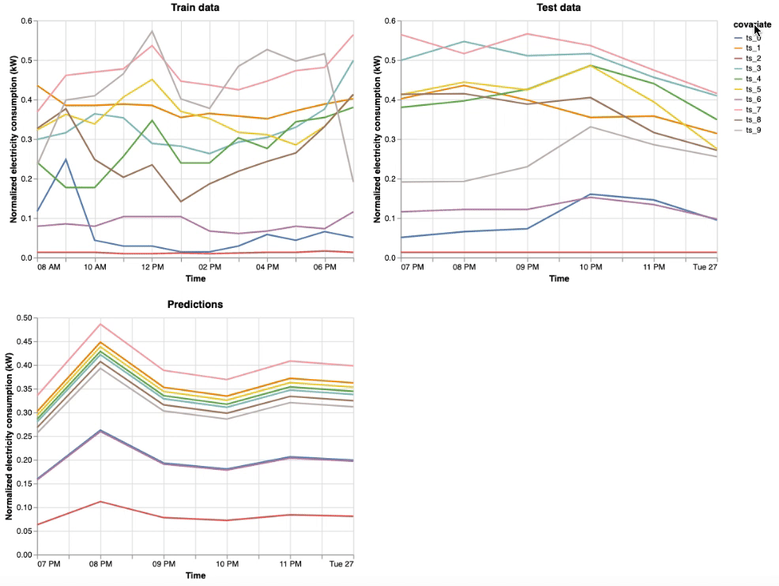

# Deep Demand Forecasting with Amazon SageMaker

  
  
  
   
  
  
  
 

This project provides an end-to-end solution for **Demand Forecasting** task using a new state-of-the-art *Deep Learning* model [LSTNet](https://arxiv.org/abs/1703.07015) available in [GluonTS](https://github.com/awslabs/gluon-ts) and [Amazon SageMaker](https://aws.amazon.com/sagemaker/).

## Demand Forecasting

Demand forecasting uses historical time-series data to help streamline the supply-demand decision-making process across businesses. Examples include predicting the number of

* Customer representatives to hire for multiple locations in the next month
* Product sales across multiple regions in the next quarter
* Cloud server usage for next day for a video streaming service
* Electricity consumption for multiple regions over the next week
* IoT devices and sensors such as energy consumption

## Deep Learning for Time Series Forecasting

The status quo approaches for time-series forecasting include:

* [Auto Regressive Integrated Moving Average](https://en.wikipedia.org/wiki/Autoregressive_integrated_moving_average) (ARIMA) for **univariate** time-series data and
* [Vector Auto-Regression](https://en.wikipedia.org/wiki/Vector_autoregression) (VAR) for **multi-variate** time-series data

These methods often require tedious data preprocessing and features generation prior to model training. One main advantage of Deep Learning (DL) methods such as LSTNet is *automating the feature generation* step prior to model training such as incorporating various data normalization, lags, different time scales, some categorical data, dealing with missing values, etc. with better prediction power and fast GPU-enabled training and deployment.

Please check out our [blog post](https://towardsdatascience.com/deep-demand-forecasting-with-amazon-sagemaker-e0226410763a) for more details.

## Getting Started

You will need an AWS account to use this solution. Sign up for an account [here](https://aws.amazon.com/).

The easiest is to click on the following button to create the *AWS CloudFormation Stack* required for this solution

<table align="center">
  <tr>
    <th colspan="3">AWS Region</td>
    <th>AWS CloudFormation</td>
  </tr>
  <tr>
    <td>US West</td>
    <td>Oregon</td>
    <td>us-west-2</td>
    <td align="center">
      
    </td>
  </tr>
</table>

Then acknowledge adding the default [AWS IAM policy](https://aws.amazon.com/iam/) or use your own policy

*  Click on the **Create Stack** (you can leave the pre-specified *Stack name*, *S3 Bucket Name* and SageMaker Notebook Instance as they are)
*  Once the stack was created, go to the **Outputs tab** and click on the **SageMakerNotebookInstanceSignOn** link to directly go to the created notebook instance
*  Finally, click on **deep-demand-forecast.ipynb** notebook and follow the instruction inside the notebook

Alternatively, you can clone this repository then navigate to [AWS CloudFormation](https://aws.amazon.com/cloudformation/) in your account and use the provided [CloudFormation template](deploy/sagemaker-deep-demand-forecast.yaml) to create the AWS resources needed to train and deploy the model using the SageMaker [deep-demand-forecast](src/deep-demand-forecast.ipynb) notebook.

  

## Contents

* `deploy/sagemaker-deep-demand-forecast.yaml`: Creates the AWS stack for this solution
* `src/`
  * `preprocess/`
  * `container/`: To build and register the preprocessing ECR job
    * `Dockerfile`: Docker container config
    * `build_and_push.sh`: Build and push bash scripts used in `deep-demand-forecast.ipynb`
    * `requirements.txt`: Dependencies for `preprocess.py`
  * `preprocess.py`: Preprocessing script
  * `deep_demand_forecast/`: Contains the train and inference code
    * `train.py`: SageMaker train code
    * `inference.py`: SageMaker inference code
    * `data.py`: [`GluonTS`](https://gluon-ts.mxnet.io/api/gluonts/gluonts.dataset.html) data preparation
    * `metrics.py`: A training metric
    * `monitor.py`: Preparing results for visualization
    * `utils.py`: Helper functions
    * `requirements.txt`: Dependencies for SageMaker MXNet Estimator
  * `deep-demand-forecast.ipynb`: See below

## What Does `deep-demand-forecast.ipynb` Offer?

The notebook trains an [LSTNet](https://gluon-ts.s3-accelerate.dualstack.amazonaws.com/master/api/gluonts/gluonts.model.lstnet.html) estimator [*on electricity consumption data*](https://archive.ics.uci.edu/ml/datasets/ElectricityLoadDiagrams20112014) which is multivariate timeseries dataset capturing the electricity consumption (in kW) with **15min** frequency from **2011-01-01** to **2014-05-26**. We compare the model performance by visualizing the metrics [MASE](https://en.wikipedia.org/wiki/Mean_absolute_scaled_error) vs. [sMAPE](https://en.wikipedia.org/wiki/Symmetric_mean_absolute_percentage_error)

  
  

Finally, we deploy an endpoint for the trained model and can interactively compare its performance by comparing the train, test data and predictions.

  

## Architecture Overview

The project contains

* [**Preprocessing**](src/preprocess) step, designed as a *microservice* that allows users to build and register their own Docker image for this task via [Amazon ECR](https://aws.amazon.com/ecr/) and execute the job in [Amazon SageMaker](https://aws.amazon.com/sagemaker/)
* Interactive **training**, **evaluating** and **visualizing** the results in the provided [SageMaker notebook](source/deep_demand_forecast.ipynb)
* **Deplying** and **testing** an [HTTPS endpoint](https://docs.aws.amazon.com/sagemaker/latest/dg/how-it-works-hosting.html)
* Monitoring the deployed model via [Amazon CloudWatch](https://aws.amazon.com/cloudwatch/)

Here is the visual architecture

  

## Cleaning Up

When you've finished with this solution, make sure that you delete all unwanted AWS resources. AWS CloudFormation can be used to automatically delete all standard resources that have been created by the solution and notebook. Go to the AWS CloudFormation Console, and delete the parent stack. Choosing to delete the parent stack will automatically delete the nested stacks.

**Caution:** You need to manually delete any extra resources that you may have created in this notebook. Some examples include, extra Amazon S3 buckets (to the solution's default bucket), extra Amazon SageMaker endpoints (using a custom name), and extra Amazon ECR repositories.

## Customization

To use your own data, please take a look at

* [Extensive GluonTS tutorials](https://gluon-ts.mxnet.io/examples/index.html)
* Consult with the [dataset API](https://gluon-ts.mxnet.io/api/gluonts/gluonts.dataset.html)

## Useful Resources

* [Amazon SageMaker Getting Started](https://aws.amazon.com/sagemaker/getting-started/)
* [Amazon SageMaker Developer Guide](https://docs.aws.amazon.com/sagemaker/latest/dg/whatis.html)
* [Amazon SageMaker Python SDK Documentation](https://sagemaker.readthedocs.io/en/stable/)
* [AWS CloudFormation User Guide](https://docs.aws.amazon.com/AWSCloudFormation/latest/UserGuide/Welcome.html)

## License

This project is licensed under the Apache-2.0 License.
